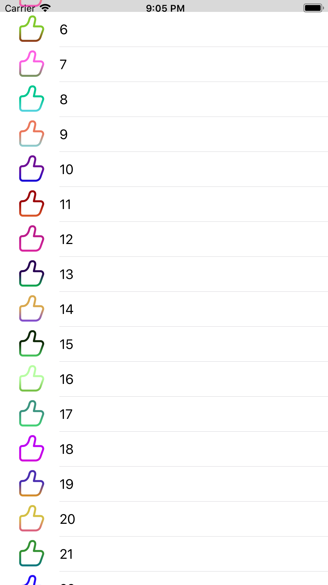
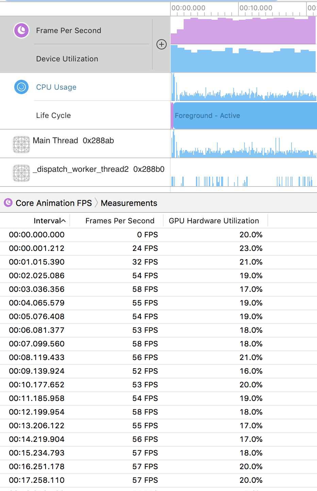
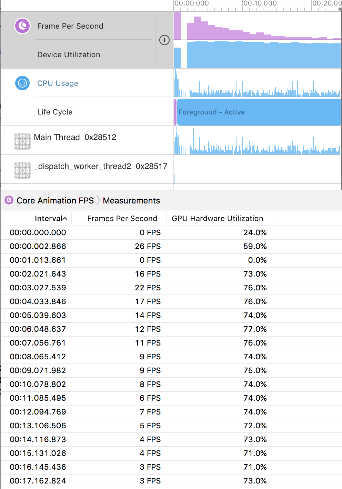
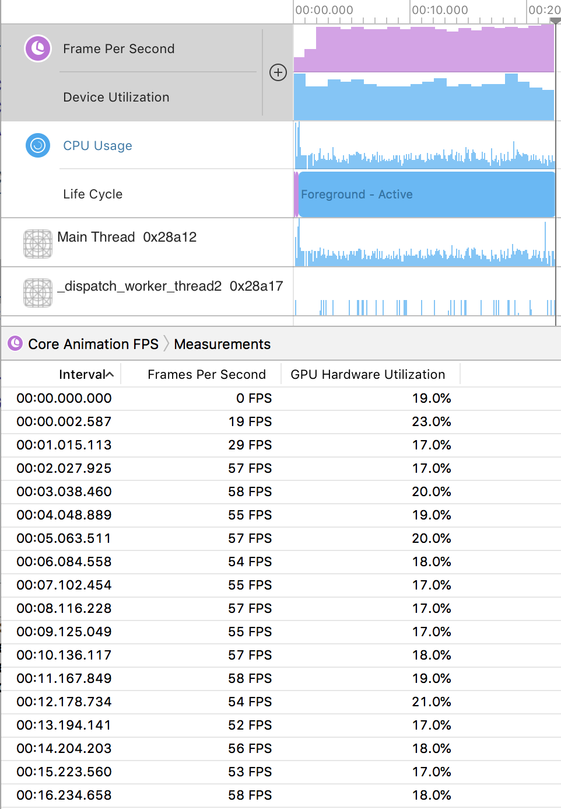

# 渐变蒙层
## 0.背景
有这样一个场景：设计师提供了一套图标，需要做换肤功能，即给定的图标需要能够变化各种颜色，甚至加上渐变色。

也即是下图1+图2=图3


iOS 的实现是比较简单的，下文将列举两种方式实现。本文重点在于通过两种实现方式，逐步深入讲解 iOS 的图片渲染及性能优化。

## 1.实现方案

本文将提供2种实现方案，并对其进行分析：

### ① 使用蒙层
使用蒙层的方法，实现比较简单，会返回一个 CALayer ，可以直接加载 UIView 上：

```
- (CAGradientLayer *)getGradientLayer:(CGRect)frame colors:(NSArray *)colors {
    CAGradientLayer *gradientLayer = [CAGradientLayer layer];
    gradientLayer.frame = frame;
    gradientLayer.colors = colors;
    gradientLayer.startPoint = CGPointMake(0.5, 0.5);
    gradientLayer.endPoint = CGPointMake(0.5, 1.0);
    gradientLayer.mask = [CALayer layer];
    gradientLayer.mask.frame = gradientLayer.bounds;
    
    gradientLayer.mask.contents = (__bridge id _Nullable)([UIImage imageNamed:@"Thumbs"].CGImage);
    
    return gradientLayer;
}
```

如上，生成一个渐变的layre，然后在layer上增加图片的蒙层即可。调用方法为：

```
    UIColor *color1 = [UIColor colorWithRed:arc4random()%100/100.f green:arc4random()%100/100.f blue:arc4random()%100/100.f alpha:1];
    UIColor *color2 = [UIColor colorWithRed:arc4random()%100/100.f green:arc4random()%100/100.f blue:arc4random()%100/100.f alpha:1];
    NSArray *colors = @[(id)color1.CGColor,(id)color2.CGColor];

    UIView *view = [[UIView alloc] init];
    CAGradientLayer *layer = [self getGradientLayer:CGRectMake(100, 0, 40, 40) colors:colors];
    [view.layer addSublayer:layer];
```

### ② 使用 CoreGraphics 绘制
使用 CoreGraphics 的方法相对比较麻烦一些，会返回一个 UIImage ，可以加载到 UIImageView 上

```
- (UIImage *)getGradientImage:(CGSize)size colors:(NSArray *)colors {
    CGRect frame = CGRectMake(0, 0, size.width, size.height);
    UIGraphicsBeginImageContext(size);
    CGContextRef context = UIGraphicsGetCurrentContext();
    CGColorSpaceRef colorSpace = CGColorSpaceCreateDeviceRGB();
    CGContextScaleCTM(context, size.width, size.height);
    CGGradientRef gradient = CGGradientCreateWithColors(colorSpace, (CFArrayRef)colors, NULL);
    CGContextDrawLinearGradient(context, gradient, CGPointMake(0.5, 0.5), CGPointMake(0.5, 1), kCGGradientDrawsBeforeStartLocation);
    
    UIImage *gradientImage = UIGraphicsGetImageFromCurrentImageContext();
    UIImage *thumbsImage = [UIImage imageNamed:@"Thumbs"];
    UIGraphicsBeginImageContextWithOptions(size, NO, 0.0f);
    [gradientImage drawInRect:frame];
    [thumbsImage drawInRect:frame blendMode:kCGBlendModeDestinationIn alpha:1.0f];
    UIImage *image = UIGraphicsGetImageFromCurrentImageContext();
    
    CGGradientRelease(gradient);
    CGColorSpaceRelease(colorSpace);
    CGContextRelease(context);
    
    return image;
}
```

如上，先在图形上下文上绘制渐变，取出渐变图层，清空图层，绘制渐变图层，绘制点赞图册并取相交部分，取出图层。调用方法为：

```
    UIColor *color1 = [UIColor colorWithRed:arc4random()%100/100.f green:arc4random()%100/100.f blue:arc4random()%100/100.f alpha:1];
    UIColor *color2 = [UIColor colorWithRed:arc4random()%100/100.f green:arc4random()%100/100.f blue:arc4random()%100/100.f alpha:1];
    NSArray *colors = @[(id)color1.CGColor,(id)color2.CGColor];

    UIImageView *view = [[UIImageView alloc] init];
    UIImage *gradientImage = [self getGradientImage:CGSizeMake(40, 40) colors:colors];
    view.image = gradientImage;
```

## 2.性能测试
完成上述功能后，为了便于测试，我写了一个长100的长列表进行性能测试：



分别使用两种方式，加载渐变图片，并观测应用程序的帧率，效果如下：

不加载渐变图片，基准的帧率约为56

，GPU占用约18%

使用 layer 加载渐变图片，帧率约为10，GPU占用约74%


使用 CoreGraphics 加载渐变图片，帧率约为56，GPU占用约18%


也就是说，使用 layer 的方法，将带来严重的性能问题，会有明显卡顿。

## 3.性能分析
为什么会有这么明显的性能差异呢，比较浅显的原因是 layer 使用了蒙层，会有离屏渲染问题，所以性能差。而深入的分析，差不多要从屏幕硬件刷新说起：

### ① 硬件固定时间间隔刷新屏幕
GPU 提交的画面，会被扫描到显示屏上呈现画面，当扫描完成后，发送一个垂直同步信号VSync，表明当前帧扫描完成，开始扫描显示下一帧画面。

<font color="#ff0000">
扫描过程是通过硬件产生的定时信号完成的，定时信号有固定的时钟周期，因此也要求待提交的画面，不能有额外的计算，必须是可以直接扫描画面，才能保证每次扫描不会因意外导致画面显示不完整。在 iPhone 上，每帧画面的 VSync 信号的时钟周期是1/60秒。
</font>


GPU 提交一帧，显示器扫描显示一帧，GPU 再提交一帧……这个过程看似紧凑，但是扫描完成到下一帧提交完成是需要时间的，而不等扫描完成就直接提交，又会导致画面错乱。为了解决这个问题，通常会引入双缓存机制，即 cahce1 进行扫描时，往 cache2 提交帧画面，cache1 扫描完成后直接扫描 cache2，同时发送一个 VSync 信号，GPU 收到信号后，往cache1 提交帧画面，循环往复。iOS 中即采用的这种双缓存机制。

### ② 帧画面的提交过程与丢帧
在发送 VSync 信号后，系统的图形服务会通知App，计算待显示的内容。在收到 VSync 信号，到提交帧画面之间，系统完成的操作如下：

<font color="#ff0000">
CPU 计算待显示的内容 -> 提交待渲染的图层 -> GPU 混合图层，渲染</b>
</font>

这个过程，由于 CPU 资源，GPU 资源，待渲染图层等的不可控行，会导致这个过程的耗时是不可控的。因此会出现一个情况：

<font color="#ff0000">
系统发送了 VSync 信号，新一帧画面生成的时机过长，系统发送了下一个 VSync 信号。在这个场景下，由于当前帧画面耗时不定，系统不可能一直等待，所以此时最佳的策略是将当前未完成的帧画面丢失，CPU/GPU 再去生成下一个帧画面，并在下一个时钟周期时提交，此时就发生了丢帧及画面卡顿。好比视频通话时，当前的画面卡住了，最佳的做法是丢掉当前帧而不是死等，以保证后续视频流畅。
</font>

### ③ 丢帧原因的分析及解决方案 - CPU
为了保证数据和显示图像一致，移动端操作系统通常都限制UI操作在串行的主线程，也就是大家常说的，主线程阻塞，导致页面卡顿。

CPU 计算的主线程消耗，常见的几个场景：1.布局计算；2.文本控件的绘制；3.图片的解码。这些问题的分析及解决方案网上可以搜到很多，此处不再赘述。

### ④ 丢帧原因的分析及解决方案 - GPU
GPU 的图层混合，离屏渲染等。这里会涉及少量图形知识，后续有时间单独开一章总结。

结论的话，以下行为会导致 GPU 资源消耗增加，进而导致丢帧：

> 1.不透明图层混合；  
> 2.CALayer 的圆角、阴影、蒙层、抗锯齿

以及需要相对取舍的 CALayer 的光栅化。

## 4.总结
综上，1.实现方案，2.性能测试，3.性能分析，三者可以很好的串联起来了：

> 使用 CALayer 的 mask 实现，会导致离屏渲染，增加 GPU 资源消耗，当 GPU 资源消耗较大时，会导致两个 VSync 信号时间间隔内，无法完成帧画面提交，从而引发丢帧，即用户可以感知到的卡顿；
> 
> 使用 CoreGraphics 实现，是在 CPU 主线程，使用图形上下文预先计算好，生成待渲染的图片，在 GPU 无需额外计算，避免了离屏渲染，因此性能更好一点。当然，如果有更高的性能要求，也可以把这一步放到子线程。

## 5.本文代码

https://github.com/LululuSir/XiaoMing